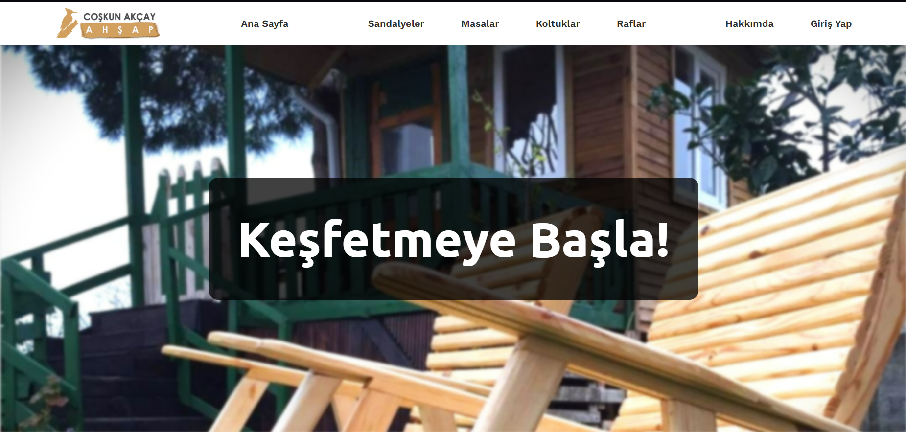
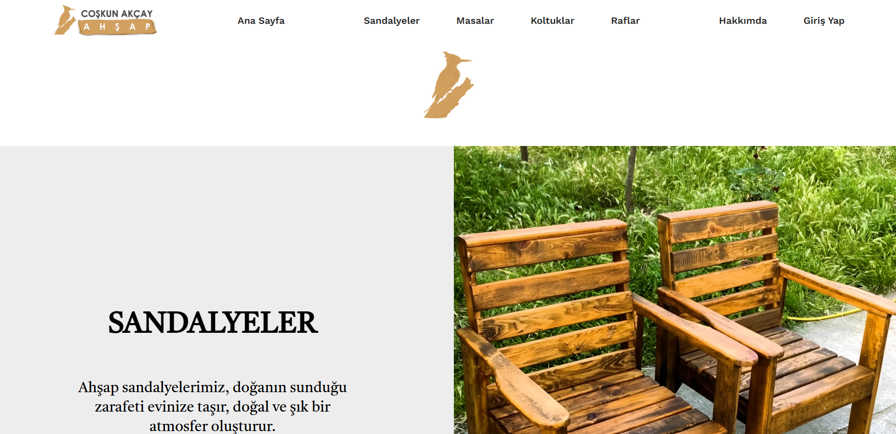
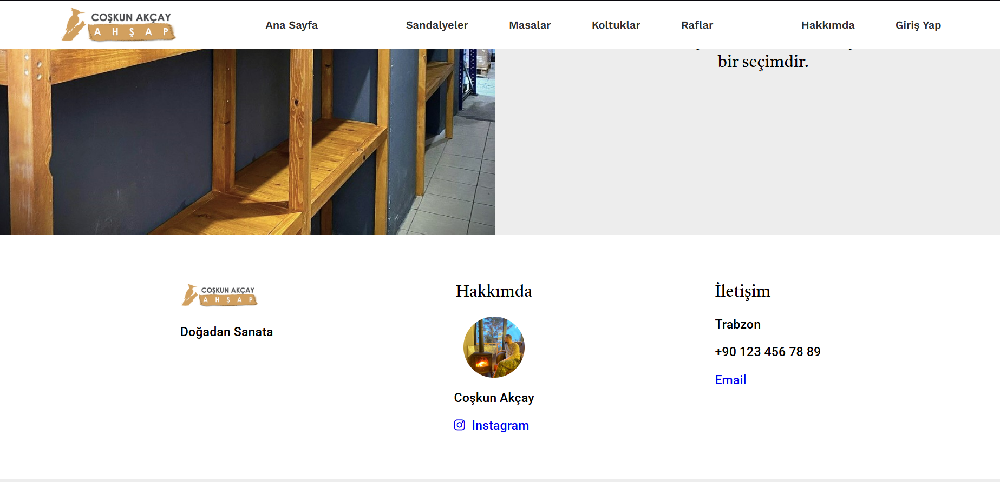
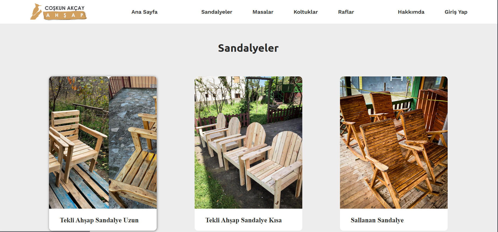
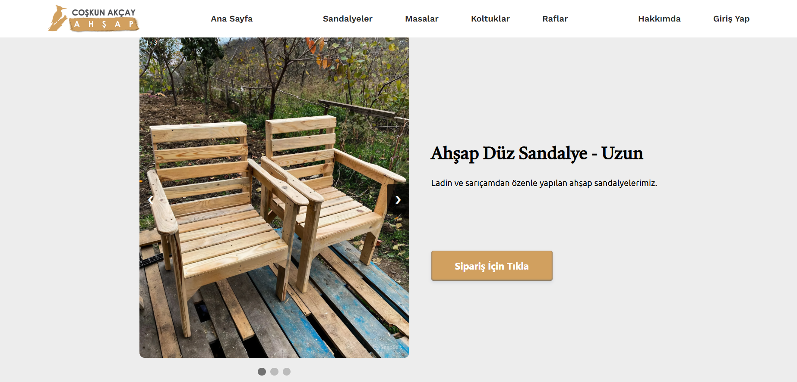
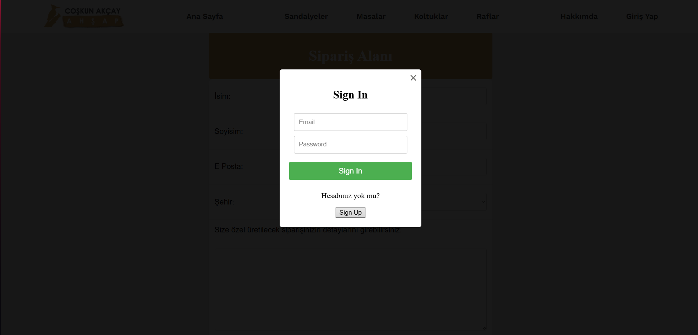

# PHP web-site

Bu proje, PHP ve MySQL kullanılarak geliştirilen temel bir kullanıcı yönetimi ve sipariş alma sistemidir. Kullanıcılar sisteme kayıt olabilir, giriş yapabilir ve sipariş verebilirler. Proje, XAMPP üzerinde local server ortamında çalışacak şekilde hazırlanmıştır.

## Proje Amacı

Bu proje, PHP backend geliştirme, form işleme, session yönetimi ve MySQL veritabanı bağlantısı konularında temel uygulamalar yapmayı amaçlayan bir web uygulamasıdır. Kullanıcılar kayıt olup giriş yaptıktan sonra sipariş oluşturabilirler.

